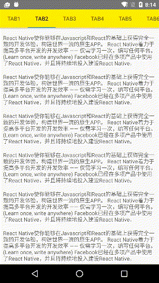

[](https://www.npmjs.com/package/mao-rn-android-kit)
# mao-rn-android-kit

为 React Native 开发 提供的一些Android原生模块/组件



---- 

包含组件

- CoordinatorLayout
- AppBarLayout
- TabLayout
- NestedScrollView
- PopupWindow

包含模块

- ExtraDimensions
- Gravity

-----

## 安装

#### 第一步、执行 ```npm install mao-rn-android-kit --save``` 安装 该npm包

#### 第二步、配置你项目中的 ```android/settings.gradle``` 文件
```
....

include ':mao-rn-android-kit'
project(':mao-rn-android-kit').projectDir = new File(settingsDir, '../node_modules/mao-rn-android-kit/android')

```

#### 第三步、配置你项目中的 ```android/app/build.gradle``` 文件
```
...
dependencies {
    ...
    compile project(':mao-rn-android-kit') // <-- 加入这条
}
```

#### 第四步、在你项目的 android 源码中注册该模块

最新版的目标文件地址是 ```android/app/src/main/your.domain/MainApplication.java```

v27版本的目标文件地址是 ```android/app/src/main/your.domain/MainActive.java```

```
...

import com.maornandroidkit.KitsPackage; // <-- 导入模块

...

    @Override
    protected List<ReactPackage> getPackages() {
        return Arrays.<ReactPackage>asList(
            ...
            new KitsPackage() // <--- 将 LibsPackage 实例 添加在这
        );
    }
...

```

#### 第五步、在项目中使用

```
import {
    CoordinatorLayoutAndroid,
    AppBarLayoutAndroid,
    TabLayoutAndroid,
    NestedScrollViewAndroid,
    ExtraDimensionsAndroid
} from 'mao-rn-android-kit';


// 详细请看 源码中的 example/index.android.js 使用例子

```

------

## 查看Demo

demo 位于 ```example/``` 目录下

```
# > mao-rn-android-kit/
$ cd example/
$ npm install
$ react-native run-android
```
-----

## API

### CoordinatorLayoutAndroid

属性
```
layoutParams: {
    width: number | "match_parent" | "wrap_content"
    height: number | "match_parent" | "wrap_content"
}

fitsSystemWindows: boolean;
```

方法
```
/**
 * 设置目标元素 app:layout_behavior 为  AppBarLayout.ScrollingViewBehavior
 * @param {Component} view 目标视图, 必须是 NestedScrollView 或 RecyclerView， 或者这两者的父容器
 */
setScrollingViewBehavior(view: Component);

/**
 * 将CoordinatorLayout 控制的AppBarLayout 伸缩效果重置到初始位置
 * @param {AppBarLayout} appbar 
 * @param {boolean} nestedScrollEnabled 控制 CoordinatorLayout 是否响应 scrollview 滚动, 默认是true
 * @param {boolean} smoothly 是否开启平滑滚动的动画效果，默认不开启
 */
resetBehavior(appbar: AppBarLayout, nestedScrollEnabled, smoothly: boolean);

```
----

### AppBarLayoutAndroid

常量
```
// 以下常量配合 scrollFlag属性用
AppBarLayoutAndroid.SCROLL_FLAG_ENTRY_ALWAYS
AppBarLayoutAndroid.SCROLL_FLAG_ENTRY_ALWAYS_COLLAPSED
AppBarLayoutAndroid.SCROLL_FLAG_EXIT_UNTIL_COLLAPSED
AppBarLayoutAndroid.SCROLL_FLAG_SCROLL
AppBarLayoutAndroid.SCROLL_FLAG_SNAP

```

属性
```
layoutParams: {
    width: number | "match_parent" | "wrap_content"
    height: number | "match_parent" | "wrap_content"
    scrollFlag: number
}

fitsSystemWindows: boolean;
```

----

### TabLayoutAndroid

属性
```
//选项卡项目
tabs: { text: string }[];

//选项卡字体大小
tabTextSize: number;

//选项卡项目默认字体颜色 
tabTextColor: string;

//选项卡项目选中字体颜色 
tabSelectedTextColor: string;

//选项卡下标线颜色 
tabIndicatorColor: string;

//选项卡下标线高度
tabIndicatorHeight: number;

//选项卡项目布局模式
tabMode: "scrollale" | "fixed";

//选卡布局位置
tabGravity: "center" | "fill";

//选项卡高度
tabHeight: number;

//选项卡侧边(左右边)边距
tabSidePadding: number;

```

方法
```
/**
 * 绑定 viewPager
 * @param {ViewPagerAndroid} viewPager
 *  绑定的viewPager组件
 * @param {{text: string}[]} tabs
 *  设置选项卡项目
 * @param {boolean} smoothScroll
 *  从选项卡被选中后触发viewPager的同步切换时 是否开启平滑滚动的动画效果，默认开启
 */
setViewPager(viewPager: ViewPagerAndroid, tabs: {text: string}[], smoothScroll: boolean);

/**
 * 设置 宽高尺寸, 使用 TabLayout的 Layoutparams 修改这些尺寸信息
 * @param {number | "wrap_content" | "match_parent"} width
 * @param {number | "wrap_content" | "match_parent"} height
 */
setViewSize(width: number | "wrap_content" | "match_parent", height?: number | "wrap_content" | "match_parent");
```

----

### NestedScrollViewAndroid

属性, 继承 ScrollView 的属性
```
...

//显示水平轴滚动标记
showVerticalScrollIndicator: boolean;
```

方法, 继承 ScrollView的方法
```

```

----

### ExtraDimensionsAndroid

方法
```
/** 
 * 获取设备实际屏幕高度
 * @return {boolean}
 */
getScreenHeight(): number;

/**
 * 获取设备实际屏幕宽度
 * @return {boolean}
 */
getScreenWidth(): number;

/** 
 * 获取魅族SmartBar高度
 * @return {boolean}
 */
getSmartBarHeight(): number;

/**
 * 获取软键盘导航按钮高度
 * @return {boolean}
 */
getSoftMenuBarHeight(): number;

/**
 * 获取状态栏高度
 * @return {boolean}
 */
getStatusBarHeight(): number;

/**
 * 获取APP可视容器宽度
 * @return {boolean}
 */
getAppClientWidth(): number;

/**
 * 获取APP可视容器高度
 * @return {boolean}
 */
getAppClientHeight(): number;
```
----

### PopupWindowAndroid

方法
```
/**
 * 将弹出窗口显示在目标视图元素下方
 * @param {Component}  view 
 *  目标视图元素
 * @param {number} x
 *  x轴偏移
 * @param {number} y
 *  y轴偏移
 */
showAsDropdown(view: Component, x: number, y: number): void;

/**
 * 将弹出窗口显示在指定位置
 * @param {number} gravity
 *  详细值参考 [Gravity](https://developer.android.com/reference/android/view/Gravity.html)
 * @param {number} x
 *  x轴偏移
 * @param {number} y
 *  y轴偏移
 */
showAsLocation(gravity: number, x: number, y: number): void;

/**
 * 隐藏弹出层窗口
 */
hide(): void;
```

属性
```
// focusable
focusable?: boolea;

// 弹出窗口内是否接收触摸事件
touchable?: boolea;

// 点击弹出窗口外时 是否隐藏弹出窗口
outsideTouchable?: boolean; 
```

----

### GravityAndroid

[Gravity](https://developer.android.com/reference/android/view/Gravity.html)

参考过:

- [react-native-android-design-support](https://github.com/Neson/react-native-android-design-support)
- [react-native-extra-dimensions-android](https://github.com/BelinChung/react-native-extra-dimensions-android)